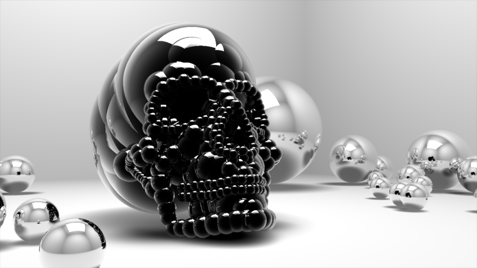

# 4K executable graphics, GLSL realtime raytracing
4k Framework borrowed from https://github.com/armak/Leviathan-2.0 
Unity project for editing the "mesh" 
Make sure you force using your discrete GPU on Windows 

